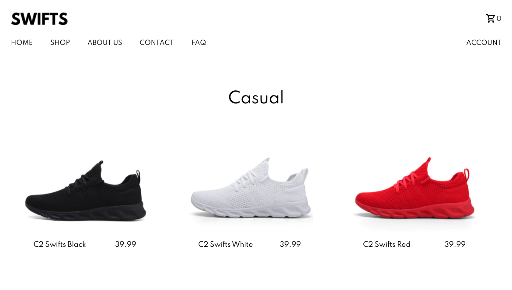

# Swifts

## Description

Swifts is a fictional shoe ecommerce application built using the MERN (MongoDB, Express, React.js, Node.js). Some key features are user authentication, contact form, add to cart functionality, faq page, and stripe checkout.

## Table of Contents

- [Description](#description)
- [Technology](#technology)
- [User Story](#user-story)
- [Installation](#installation)
- [Usage](#usage)
- [License](#license)
- [Contributing](#contributing)
- [Tests](#tests)
- [Questions](#questions)
- [Deployed Application URL](#deployed-application-URL)

## Technology

- React.js
- Redux
- React Selectors
- React Hooks
- Firebase (user authentication)
- Mongoose
- MongoDB
- Express
- Node
- Material UI
- CSS
- HTML
- JavaScript

## User Story

## Installation

npm install in root folder to install dependancies for backend and frontend.

## Usage

The deployed link will take you to the homepage. Click on any of the links in the header to view that respective page. View swift products and add products to your cart. Click on pay now and use the test credit card to complete the checkout process. Users have the option to log in or create an account. You can use the credentials below to log in or you can create your own acccount.

Public Login Credentials

- email: cool_coder@email.com
- password: 12341234

## License

## Contributing

Please follow standard contributing guidelines.

## Tests

No tests to run.

## Questions

For any questions, please contact kendayao at kendayao@gmail.com

## Deployed Application URL

Deployed application link: https://swifts.herokuapp.com/

